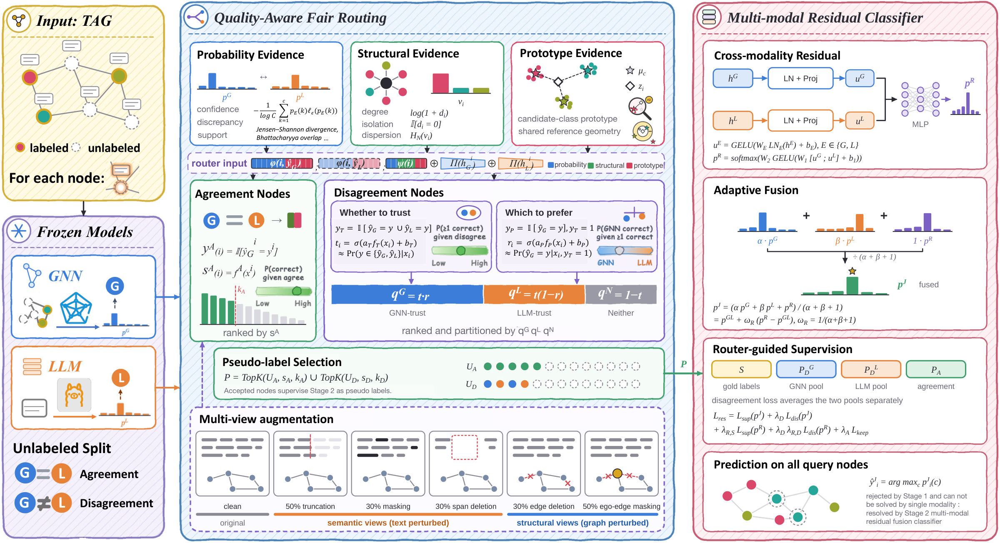

# FairRouter

Code for **Whether to Trust GNNs or LLMs? FairRouter for Few-Shot Node Classification**.

## Overview

FairRouter combines graph structure and node text for few-shot node classification on text-attributed graphs. It uses two frozen experts, a GNN and an LLM, in two stages:

1. **Quality-aware fair routing:** estimate prediction reliability and select pseudo-labels from the two experts using probability, structural and class-prototype evidence.
2. **Multi-modal residual classification:** train a residual classifier with labeled support nodes and selected pseudo-labels, then fuse its predictions with the expert distributions.

[](paper/FairRouter_framework.pdf)

The final prediction is

$$
p_i^J = \frac{\alpha p_i^G + \beta p_i^L + p_i^R}{\alpha + \beta + 1},
\qquad \alpha,\beta > 0.
$$

The GNN and LLM remain fixed during routing and residual-classifier training.

## Installation

Use Python 3.11. Install the dependencies and the package from the repository root:

```bash
python -m venv .venv
source .venv/bin/activate
python -m pip install -r requirements.txt
python -m pip install --no-deps -e .
```

Additional dependencies for split generation and expert preparation:

```bash
python -m pip install -e '.[splits,experts]'
```

Routing and residual-classifier training use CPU. Split generation and expert preparation require the appropriate GPU environment.

## Datasets and evaluation

The experiments cover Cora, Citeseer, PubMed, ogbn-arxiv and an ogbn-products subset, with 3, 5 and 10 labels per class and seeds 42, 43 and 44: 45 experiment settings in total. The default experts are GCN and LLaMA3-8B.

Each split contains:

- `support_ids`: labeled nodes used for training.
- `valid_ids`: nodes used for validation and model selection.
- `unlabeled_ids`: the complete query partition.
- `standard_eval_ids`: the 1,000 query nodes used for reported evaluation.

For each dataset and seed, `standard_eval_ids` contains exactly the same nodes in the same order across label budgets. The evaluation sample is drawn from the 10-shot query partition and is also a subset of the query partition for every other budget. Query labels are used only for final evaluation.

Generate splits from preprocessed PyG graph files:

```bash
python scripts/make_splits.py \
  --data-root /path/to/graphs \
  --arxiv-split-dir /path/to/ogbn_arxiv/split/time \
  --datasets cora citeseer pubmed arxiv ogbn-products \
  --shots 3 5 10 --seeds 42 43 44 --device cuda:0 \
  --output /path/to/splits
```

The graph directory must contain `cora.pt`, `citeseer.pt`, `pubmed.pt`, `arxiv.pt` and `ogbn-products.pt`. Arxiv also requires its official time-split files. Keep graph nodes and node texts in the same order. Generated splits include a `SHA256SUMS` file for integrity checking.

## Inputs

The experiment runner requires a prepared bundle containing expert predictions, representations, splits and reference models. Supply its location with `--bundle`; supply a new result location with `--output`.

For expert preparation, provide preprocessed graphs, node texts, class names and local LLaMA3-8B-Instruct weights. Dataset recipes are in `configs/experts/`; LLM prompt and inference settings are in `configs/llm/`. The following commands describe the required arguments:

```bash
python -m fairrouter.pretrain_gnn --help
python -m fairrouter.infer_llm --help
python -m fairrouter.generated verify --help
```

Generated expert inputs must pass compatibility verification against the prepared bundle before use with the experiment runner.

## Run experiments

Run one setting:

```bash
python -m fairrouter run \
  --bundle /path/to/bundle --output /path/to/run/cells \
  --dataset cora --shot 3 --seed 42 --mode refit-all
```

Available modes:

| Mode | Operation |
| --- | --- |
| `refit-all` | Refit the configured routing estimators and train the residual classifier. |
| `refit-joint` | Use prepared routing estimators and train the residual classifier. |
| `replay` | Use prepared routing estimators and classifier weights for prediction. |

All modes use frozen experts. Per-setting classifier hyperparameters are listed in `configs/cells/`. The runner checks results against the prepared reference models.

To run all 45 settings, use a new result location:

```bash
for index in $(seq 0 44); do
  python -m fairrouter run \
    --bundle /path/to/bundle --output /path/to/run/cells \
    --index "$index" --mode refit-all || exit 1
done
```

On a Slurm cluster, `bash run.sh /path/to/bundle /path/to/new-run refit-all` submits all settings and their evaluation. Set `FAIRROUTER_PARTITION` and `FAIRROUTER_PYTHON` for the cluster environment.

## Evaluate

After all 45 settings have completed:

```bash
python -m fairrouter evaluate \
  --bundle /path/to/bundle \
  --run /path/to/run/cells --output /path/to/run/evaluation
```

Evaluation reports Accuracy and Macro-F1 using `standard_eval_ids`. Results include `per_seed.csv`, `summary.csv` and `REPORT.md`. Aggregate results report the mean and population standard deviation across the three seeds.

## Repository structure

| Path | Contents |
| --- | --- |
| `src/fairrouter/` | Experiment entry points, expert preparation, routing, training and evaluation. |
| `src/eargtc/` | Evidence features, routing estimators and supervision utilities. |
| `configs/` | Experiment settings and input specifications. |
| `splits/` | Split files and their checksum manifest. |
| `scripts/` | Split generation and cluster submission. |
| `tests/` | Input, computation and workflow checks. |
| `paper/` | Paper and method figure. |

## License

The source code is available under the [MIT License](LICENSE). Datasets and pretrained models remain subject to their respective licenses.
